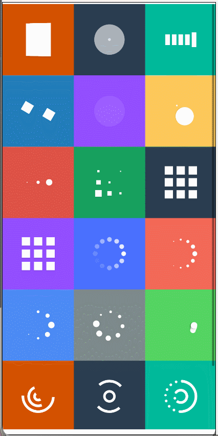

# <center>SpinKit (基于API11)</center>

--------------------------------------------------------------------------------

## 📚简介

[SpinKit](https://ohpm.openharmony.cn/#/cn/detail/@pura%2Fspinkit)
是一个适用于OpenHarmony/HarmonyOS的加载动画库

## 📚下载安装

`ohpm i @pura/spinkit`

OpenHarmony ohpm  
环境配置等更多内容，请参考[如何安装 OpenHarmony ohpm 包](https://ohpm.openharmony.cn/#/cn/help/downloadandinstall)

## 📚效果图
效果图略有卡顿，请运行源码或添加依赖，查看效果。



## 📚SpinKit组件

| 属性        | 介绍         |
|:----------|:-----------|
| spinType  | 动画的类型      |
| spinSize  | 动画的大小，默认60 |
| spinColor | 动画的颜色，默认白色 |

 ```
  SpinKit()
  
  SpinKit({ spinType: SpinType.spinA })
  
  SpinKit({ spinType: SpinType.spinH })
  
  SpinKit({
     spinType: SpinType.spinA,
     spinColor: Color.Pink,
     spinSize: 70
  })
 ```

## 📚SpinKit加载框的方法与属性

| 方法              | 介绍       |
|:----------------|:---------|
| setGlobalConfig | 设置全局统一样式 |
| showLoading     | 显示加载框    |
| hide            | 隐藏加载框    |

| 属性              | 介绍                                   |
|:----------------|:-------------------------------------|
| spinType        | 动画的类型                                |
| spinSize        | 动画的大小，默认60                           |
| spinColor       | 动画的颜色，默认白色                           |
| content         | 提示文字内容                               |
| fontSize        | 提示文字大小                               |
| fontColor       | 提示文字颜色                               |
| marginTop       | 提示文字与动画的间距                           |
| padding         | padding                              |
| backgroundColor | 背景颜色，建议八位色值前两位为透明度                   |
| borderRadius    | 背景圆角                                 |
| maskColor       | Dialog蒙版颜色，默认Color.Transparent       |
| autoCancel      | 是否允许点击遮障层退出，true表示关闭弹窗。false表示不关闭弹窗。 |

 ```
  设置全局统一样式
  SpinKitDialog.setGlobalConfig((config) => {
    config.spinType = SpinType.spinD
    config.spinSize = 60
    config.spinColor = '#0A66F9'
    config.backgroundColor = '#99000000'
    config.borderRadius = 10
    config.maskColor = '#11000000'
    config.autoCancel = false
  })
    
    
  //显示弹框
  SpinKitDialog.showLoading()
    
  SpinKitDialog.showLoading({
    spinType: SpinType.spinK,
  })
    
  SpinKitDialog.showLoading({
    spinType: SpinType.spinH,
    spinColor: '#0A66F9',
    spinSize: 60,
    backgroundColor: '#99000000',
    maskColor: Color.Transparent
  })
    
  SpinKitDialog.showLoading({
    spinType: SpinType.spinB,
    spinColor:Color.White,
    autoCancel: true
  })
  
  SpinKitDialog.showLoading({
    spinType: SpinType.spinP,
    spinColor: Color.White,
    spinSize: 70,
    content: '加载中...',
    fontSize: 18,
    fontColor: Color.White,
    backgroundColor: '#AA000000',
    maskColor: Color.Transparent,
    padding: {
      top: 30,
      right: 50,
      bottom: 30,
      left: 50
    },
    marginTop: 20,
    autoCancel: true
  })
  
  
  //隐藏加载框
  SpinKitDialog.hide()
 ```

## 💖仓库地址与技术交流

[https://gitee.com/tongyuyan/spinkit](https://gitee.com/tongyuyan/spinkit)  
[https://github.com/787107497](https://github.com/787107497)   
QQ群：569512366

## 🙏贡献代码

使用过程中发现任何问题都可以提 [Issue](https://gitee.com/tongyuyan/spinkit/issues)
给我们，当然，我们也非常欢迎你给我们发 [PR](https://gitee.com/tongyuyan/spinkit/pulls) 。

## 📚开源协议

本项目基于 [Apache License 2.0](https://www.apache.org/licenses/LICENSE-2.0.html) ，请自由地享受和参与开源。

